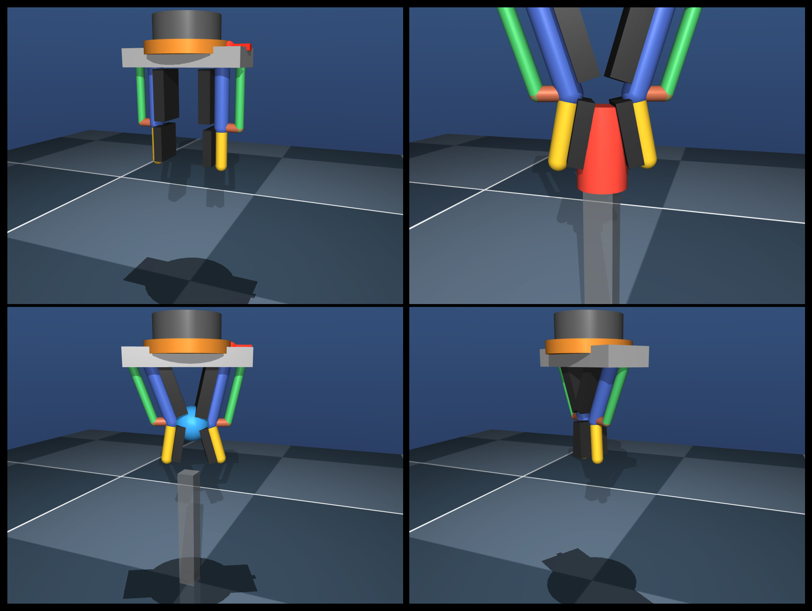
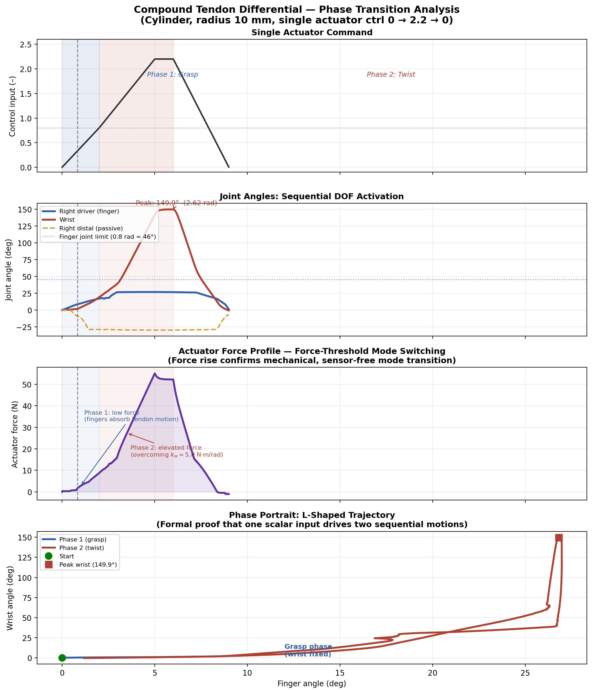
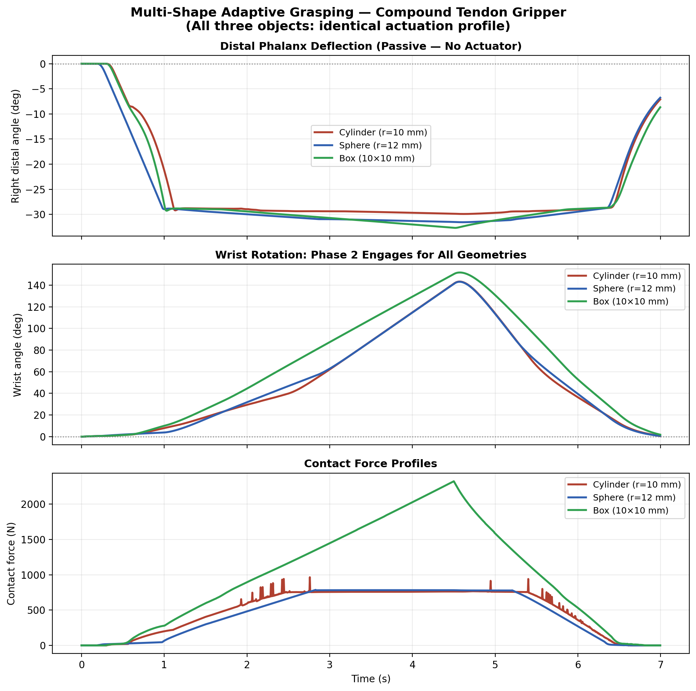

# 1-DOF Grasp-and-Twist Underactuated Gripper

MuJoCo project for **ME5250 Project 1**. This repo studies **one single mechanism**: a tendon-coupled robotic gripper that closes on an object first, then redirects the same actuator input into passive wrist rotation.



## What It Is

- **1 actuator**
- **4 mechanical DOFs**
- **2 four-bar fingers**
- **2 passive distal joints**
- **1 passive wrist joint**

The mechanism is underactuated: the fingers, distal links, and wrist do not all need separate motors. The structure and contact mechanics do the switching.



## Core Idea

A single fixed tendon couples the right finger, left finger, and wrist:

```text
master_tendon = right_driver + left_driver + 0.25 * wrist
```

In free motion, the fingers dominate. Once object contact limits finger motion, continued actuation is absorbed by the wrist, producing a grasp-and-twist behavior.

## Repo Map

- `grasp_twist_gripper.xml`: final MuJoCo mechanism used in the report
- `report.txt`: LaTeX source for the final writeup
- `report_figures.py`: regenerates the report figures
- `capture_project_video_shots.py`: records presentation-ready MuJoCo clips
- `make_screenshots.py`: generates screenshot collage assets

## Quick Start

```bash
# Run figure generation
python3 report_figures.py

# Capture project-video shots
conda run -n mini-vla mjpython capture_project_video_shots.py
```

## Main Results

- Sequential grasp-to-twist behavior from one actuator
- Passive adaptation across **cylinder**, **sphere**, and **box**
- Closed-chain four-bar modeling in MuJoCo using `connect` constraints
- Reliable cylindrical grasp range of **8 mm to 36 mm**



## Why This Repo Exists

This project is the MuJoCo-only path of the assignment: mechanism design, DOF analysis, forward kinematics, workspace/singularity study, and visual proof of underactuated behavior in simulation.
